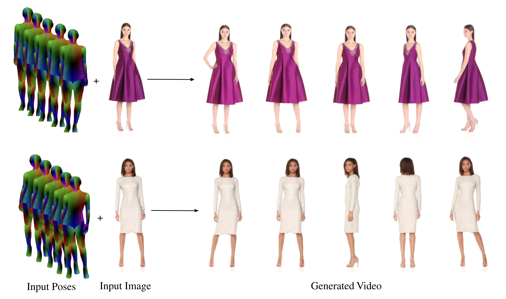

# DreamPose
Official implementation of "DreamPose: Fashion Image-to-Video Synthesis via Stable Diffusion" by Johanna Karras, Aleksander Holynski, Ting-Chun Wang, and Ira Kemelmacher-Shlizerman.

 * [Project Page](https://https://grail.cs.washington.edu/projects/dreampose/)
 * [Paper]()
 


## Demo

You can generate a video using DreamPose using our pretrained models.

1. Download pretrained models and store them into the "checkpoints" folder.
2. Run demo.py using the command below:
    ```
    python test.py --epoch 20 --folder checkpoints --pose_folder demo/sample/poses  --key_frame_path demo/sample/key_frame.png --s1 8 --s2 3 --n_steps 100 --output_dir results
    ```
    
## Download or Finetune Base Model

DreamPose is finetuned on the UBC Fashion Dataset from a pretrained Stable Diffusion checkpoint. You can download our pretrained base model from [Google Drive](https://drive.google.com/file/d/10JjayW2mMqGxhUyM9ds_GHEvuqCTDaH3/view?usp=share_link), or finetune pretrained Stable Diffusion on your own image dataset. We train on 2 NVIDIA A100 GPUs.

```
accelerate launch --num_processes=4 train.py --pretrained_model_name_or_path="CompVis/stable-diffusion-v1-4" --instance_data_dir=../path/to/dataset --output_dir=checkpoints --resolution=512 --train_batch_size=2 --gradient_accumulation_steps=4 --learning_rate=5e-6 --lr_scheduler="constant" --lr_warmup_steps=0 --num_train_epochs=300 --run_name dreampose --dropout_rate=0.15 --revision "ebb811dd71cdc38a204ecbdd6ac5d580f529fd8c"
```

## Finetune on Sample

In this next step, we finetune DreamPose on a one or more input frames to create a subject-specific model. 

1. Finetune the UNet

    ```
    accelerate launch finetune-unet.py --pretrained_model_name_or_path="CompVis/stable-diffusion-v1-4" --instance_data_dir=demo/sample/train --output_dir=demo/custom-chkpts --resolution=512 --train_batch_size=1 --gradient_accumulation_steps=1 --learning_rate=1e-5 --num_train_epochs=500 --dropout_rate=0.0 --custom_chkpt=checkpoints/unet_epoch_20.pth --revision "ebb811dd71cdc38a204ecbdd6ac5d580f529fd8c"
    ```

2. Finetune the VAE decoder

    ```
    accelerate launch --num_processes=1 finetune-vae.py --pretrained_model_name_or_path="CompVis/stable-diffusion-v1-4"  --instance_data_dir=demo/sample/train --output_dir=demo/custom-chkpts --instance_prompt="" --resolution=512  --train_batch_size=4 --gradient_accumulation_steps=4 --learning_rate=5e-5 --num_train_epochs=1500 --run_name finetuning/ubc-vae --revision "ebb811dd71cdc38a204ecbdd6ac5d580f529fd8c"
    ```

## Testing

Once you have finetuned your custom, subject-specific DreamPose model, you can generate frames using the following command:

```
python test.py --epoch 499 --folder demo/custom-chkpts --pose_folder demo/sample/poses  --key_frame_path demo/sample/key_frame.png --s1 8 --s2 3 --n_steps 100 --output_dir results --custom_vae demo/custom-chkpts/vae_1499.pth
```

### Acknowledgment

This code is largely adapted from the [HuggingFace diffusers repo](https://github.com/huggingface/diffusers).
